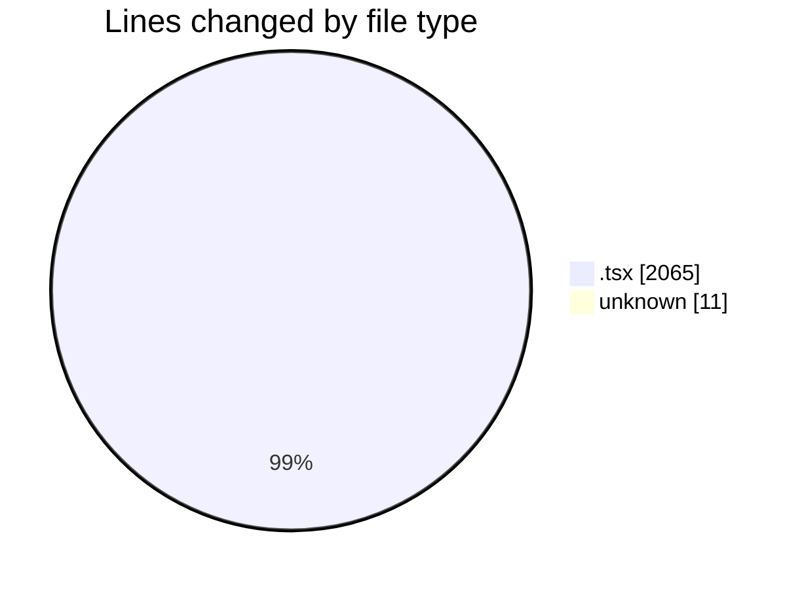
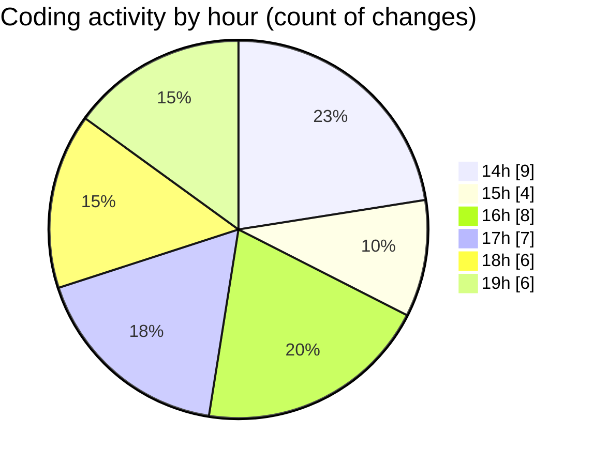

# kimberly-groups - Activity Summary 

## Overall Statistics

| Stat                   | Value                                                             |
| ---------------------- | ----------------------------------------------------------------- |
| **Lines Added** (➕)   | 1770                                          |
| **Lines Removed** (➖) | 306                                        |
| **Net Change** (↕)    | 1464                |
| **Active Time** (⌚)   | 70 minutes |

## Modified Files
- **layout.tsx** (+42, -2)
- **index.tsx** (+345, -3)
- **Bubbles.tsx** (+106, -0)
- **Button.tsx** (+66, -0)
- **Navbar.tsx** (+208, -27)
- **Scene.tsx** (+196, -0)
- **SlideShow.tsx** (+71, -0)
- **index.tsx** (+612, -274)
- **Scene.tsx** (+79, -0)
- **COMMIT_EDITMSG** (+11, -0)
- **Footer.tsx** (+34, -0)

## Visualizations

### By File Type (Lines Changed)

### By Hour (Estimated Activity Count)

> **Last Updated:** 5/28/2025, 7:55:09 PM