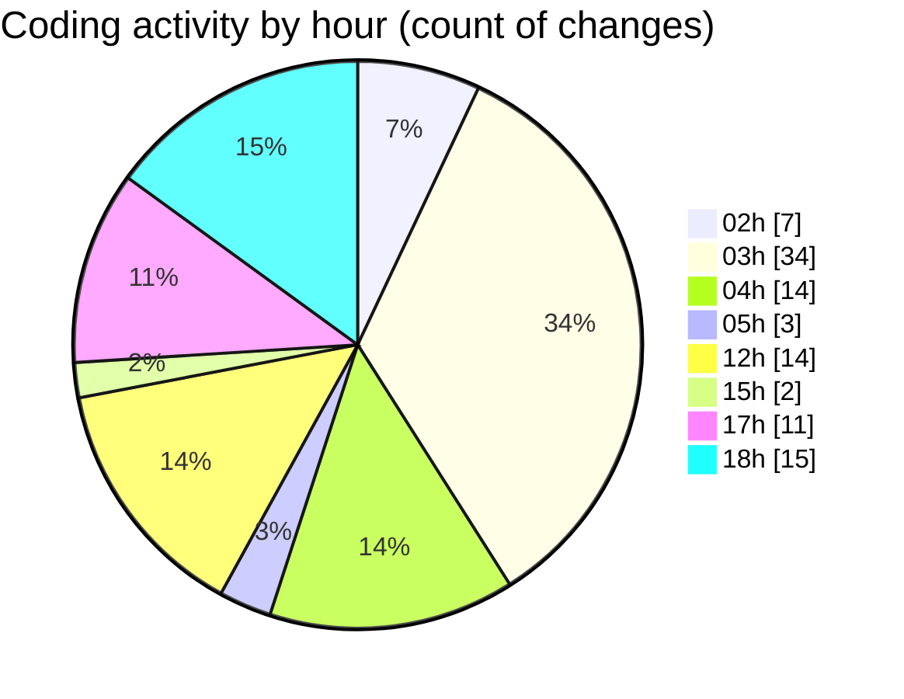

# kimberly-groups - Activity Summary 

## Overall Statistics

| Stat                   | Value                                                             |
| ---------------------- | ----------------------------------------------------------------- |
| **Lines Added** (➕)   | 3254                                          |
| **Lines Removed** (➖) | 1048                                        |
| **Net Change** (↕)    | 2206                |
| **Active Time** (⌚)   | 153 minutes |

## Modified Files
- **index.tsx** (+1282, -282)
- **index.tsx** (+1044, -457)
- **Scene.tsx** (+343, -128)
- **index.tsx** (+186, -48)
- **AlternatingLogos.tsx** (+90, -89)
- **StaticLogo.tsx** (+20, -0)
- **COMMIT_EDITMSG** (+40, -14)
- **Footer.tsx** (+115, -0)
- **Bounded.tsx** (+61, -30)
- **Button.tsx** (+33, -0)
- **layout.tsx** (+40, -0)

## Visualizations

### By File Type (Lines Changed)

### By Hour (Estimated Activity Count)

> **Last Updated:** 5/29/2025, 6:50:31 PM