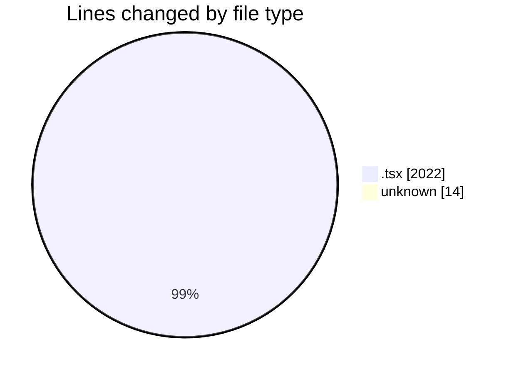
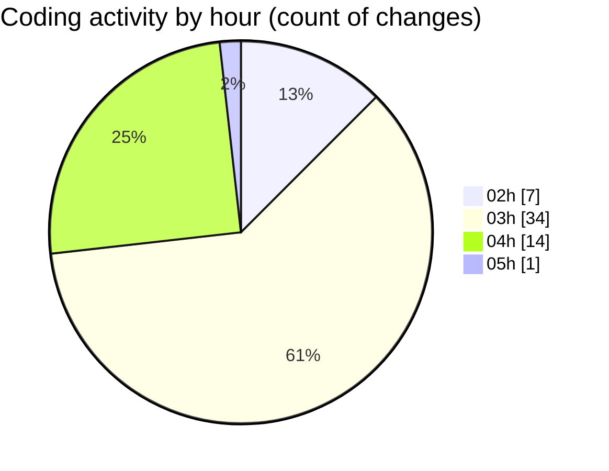

# kimberly-groups - Activity Summary 

## Overall Statistics

| Stat                   | Value                                                             |
| ---------------------- | ----------------------------------------------------------------- |
| **Lines Added** (➕)   | 1514                                          |
| **Lines Removed** (➖) | 522                                        |
| **Net Change** (↕)    | 992                |
| **Active Time** (⌚)   | 98 minutes |

## Modified Files
- **index.tsx** (+763, -263)
- **index.tsx** (+171, -0)
- **Scene.tsx** (+230, -128)
- **index.tsx** (+111, -42)
- **AlternatingLogos.tsx** (+90, -89)
- **StaticLogo.tsx** (+20, -0)
- **COMMIT_EDITMSG** (+14, -0)
- **Footer.tsx** (+115, -0)

## Visualizations

### By File Type (Lines Changed)

### By Hour (Estimated Activity Count)

> **Last Updated:** 5/29/2025, 5:00:42 AM