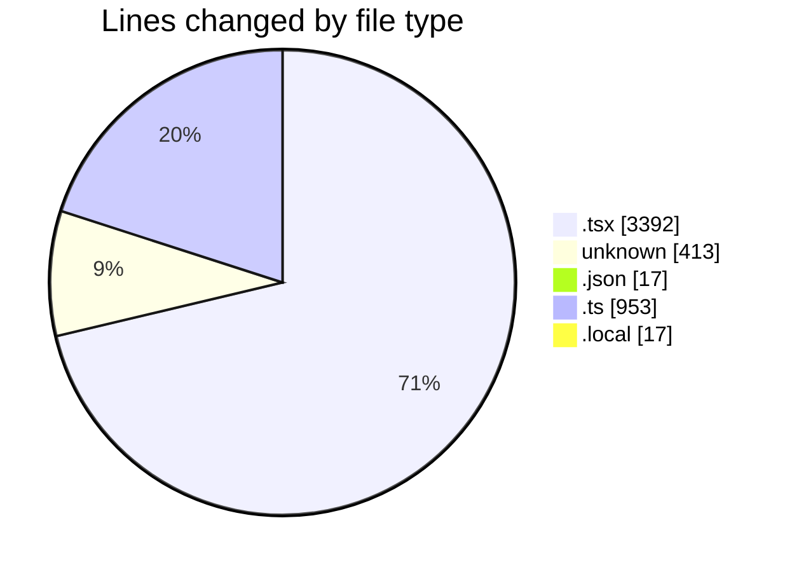
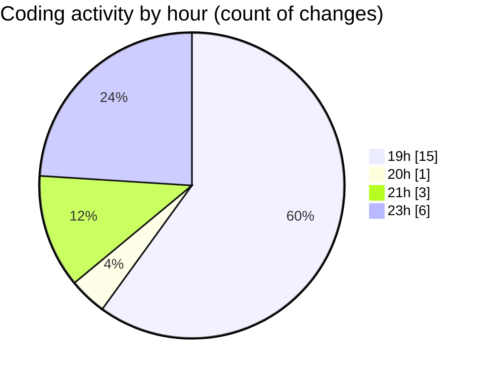

# Archive - Activity Summary 

## Overall Statistics

| Stat                   | Value                                                             |
| ---------------------- | ----------------------------------------------------------------- |
| **Lines Added** (➕)   | 4585                                          |
| **Lines Removed** (➖) | 207                                        |
| **Net Change** (↕)    | 4378                |
| **Active Time** (⌚)   | 30 minutes |

## Modified Files
- **AttendanceHistory.tsx** (+153, -0)
- **MyBatches.tsx** (+499, -0)
- **ProfileSetup.tsx** (+217, -0)
- **CoachDashboard.tsx** (+254, -0)
- **Profile.tsx** (+492, -0)
- **PaymentManagement.tsx** (+574, -0)
- **InvoicesTab.tsx** (+319, -0)
- **Leaderboard.tsx** (+113, -0)
- **SettingsTab.tsx** (+529, -0)
- **App.tsx** (+237, -5)
- **COMMIT_EDITMSG** (+209, -198)
- **vercel.json** (+15, -2)
- **vite.config.ts** (+21, -0)
- **schema.ts** (+329, -0)
- **attendance.ts** (+603, -0)
- **.env.local** (+15, -2)
- **.env** (+6, -0)

## Visualizations

### By File Type (Lines Changed)

### By Hour (Estimated Activity Count)

> **Last Updated:** 6/20/2025, 11:55:38 PM