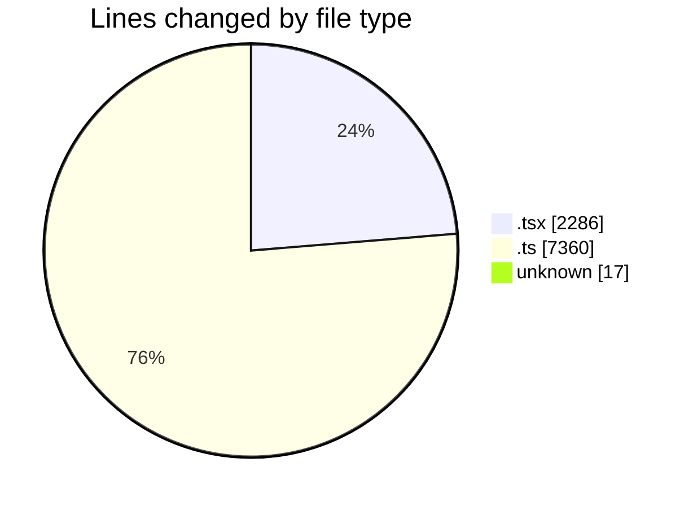
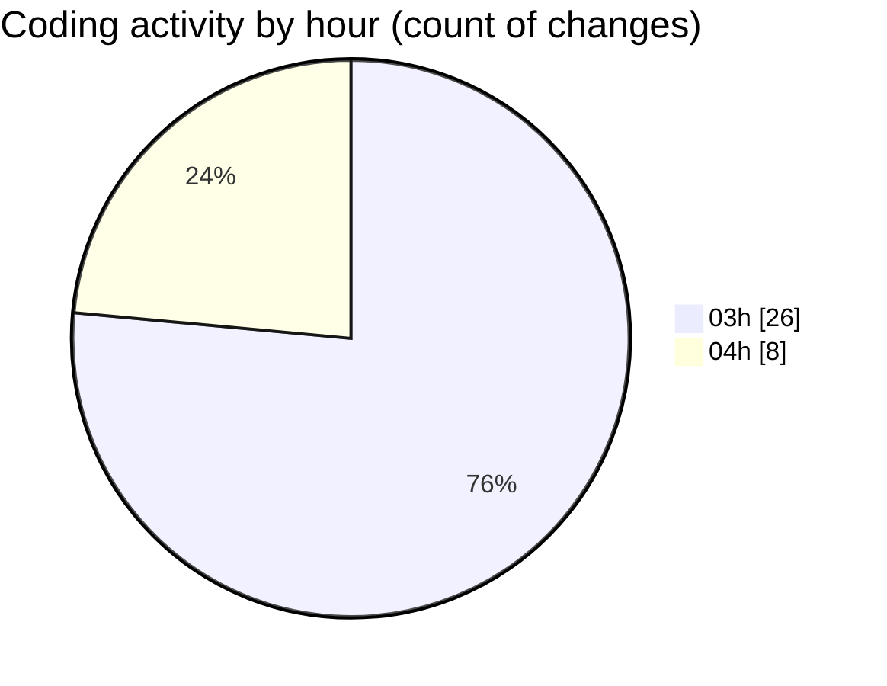

# ModelJsonDesigner - Activity Summary 

## Overall Statistics

| Stat                   | Value                                                             |
| ---------------------- | ----------------------------------------------------------------- |
| **Lines Added** (➕)   | 5011                                          |
| **Lines Removed** (➖) | 4652                                        |
| **Net Change** (↕)    | 359                |
| **Active Time** (⌚)   | 37 minutes |

## Modified Files
- **SunlightEffect.tsx** (+843, -840)
- **Scene.tsx** (+71, -21)
- **EnergyEffect.tsx** (+245, -129)
- **ProductShowcase.tsx** (+137, -0)
- **useParticleVisibility.ts** (+11, -0)
- **COMMIT_EDITMSG** (+14, -3)
- **vite.config.ts** (+3690, -3659)

## Visualizations

### By File Type (Lines Changed)

### By Hour (Estimated Activity Count)

> **Last Updated:** 6/20/2025, 4:23:19 AM