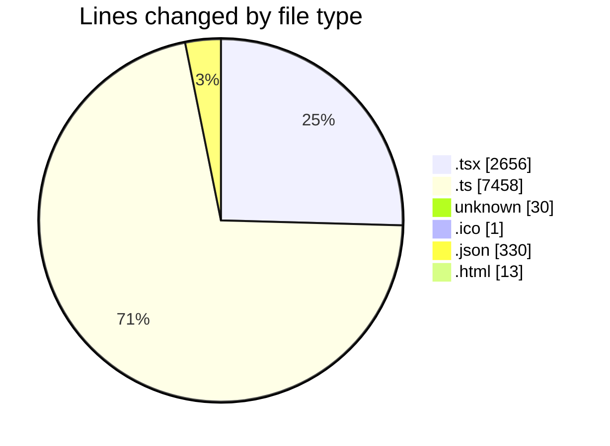
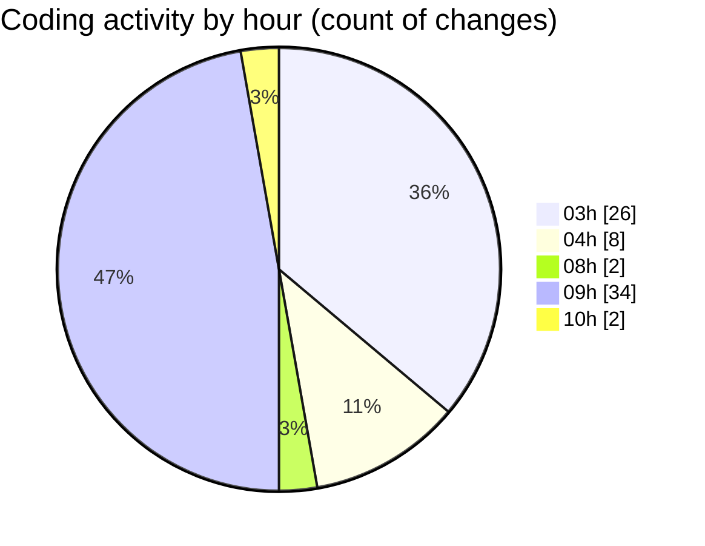

# ModelJsonDesigner - Activity Summary 

## Overall Statistics

| Stat                   | Value                                                             |
| ---------------------- | ----------------------------------------------------------------- |
| **Lines Added** (➕)   | 5759                                          |
| **Lines Removed** (➖) | 4729                                        |
| **Net Change** (↕)    | 1030                |
| **Active Time** (⌚)   | 80 minutes |

## Modified Files
- **SunlightEffect.tsx** (+952, -840)
- **Scene.tsx** (+71, -21)
- **EnergyEffect.tsx** (+375, -129)
- **ProductShowcase.tsx** (+137, -0)
- **useParticleVisibility.ts** (+11, -0)
- **COMMIT_EDITMSG** (+20, -9)
- **vite.config.ts** (+3696, -3661)
- **vite.ts** (+90, -0)
- **favicon.ico** (+1, -0)
- **package.json** (+256, -0)
- **vercel.json** (+45, -29)
- **main.tsx** (+13, -7)
- **index.html** (+13, -0)
- **App.tsx** (+78, -33)
- **_redirects** (+1, -0)

## Visualizations

### By File Type (Lines Changed)

### By Hour (Estimated Activity Count)

> **Last Updated:** 6/20/2025, 10:18:31 AM