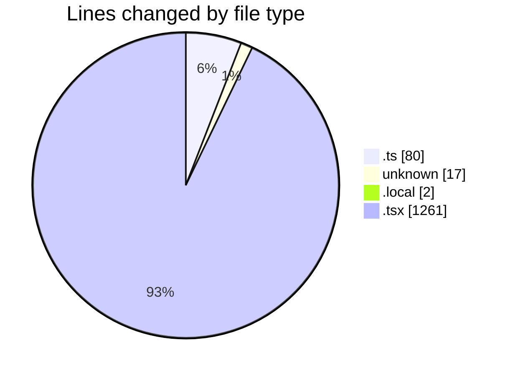
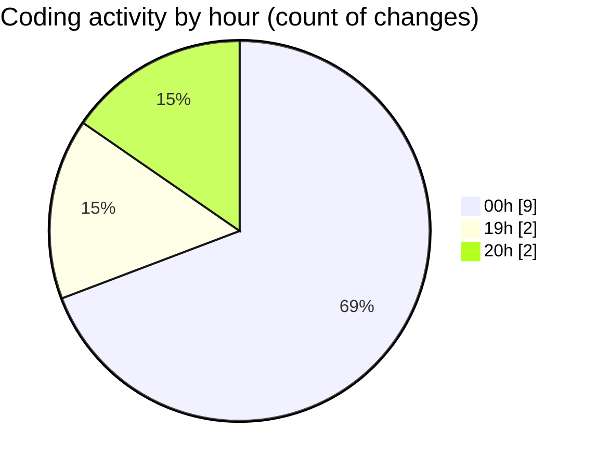

# Archive - Activity Summary 

## Overall Statistics

| Stat                   | Value                                                             |
| ---------------------- | ----------------------------------------------------------------- |
| **Lines Added** (➕)   | 1281                                          |
| **Lines Removed** (➖) | 79                                        |
| **Net Change** (↕)    | 1202                |
| **Active Time** (⌚)   | 13 minutes |

## Modified Files
- **schema.ts** (+2, -3)
- **attendance.ts** (+0, -75)
- **COMMIT_EDITMSG** (+16, -1)
- **.env.local** (+2, -0)
- **SettingsTab.tsx** (+528, -0)
- **InvoicesTab.tsx** (+318, -0)
- **StudentDashboard.tsx** (+415, -0)

## Visualizations

### By File Type (Lines Changed)

### By Hour (Estimated Activity Count)

> **Last Updated:** 6/21/2025, 8:27:35 PM