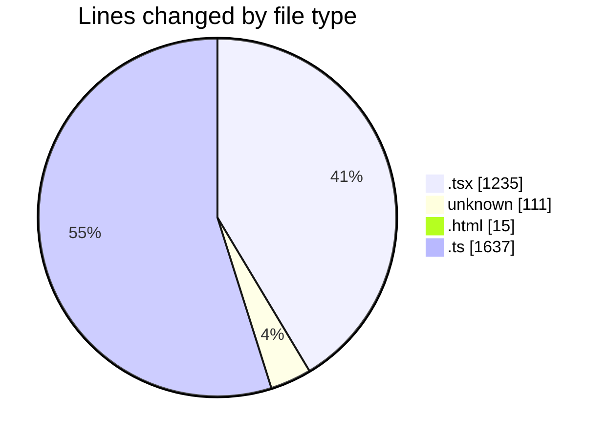
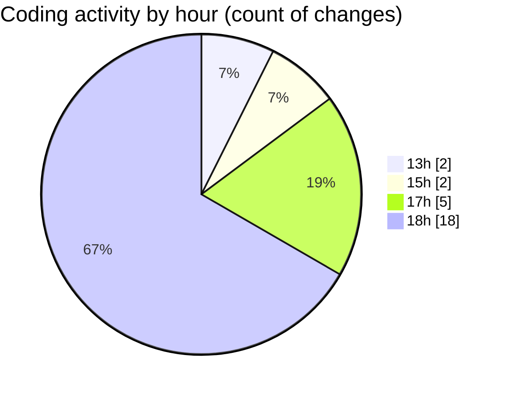

# Archive - Activity Summary 

## Overall Statistics

| Stat                   | Value                                                             |
| ---------------------- | ----------------------------------------------------------------- |
| **Lines Added** (➕)   | 2948                                          |
| **Lines Removed** (➖) | 50                                        |
| **Net Change** (↕)    | 2898                |
| **Active Time** (⌚)   | 27 minutes |

## Modified Files
- **RBACManagementTab.tsx** (+815, -0)
- **COMMIT_EDITMSG** (+61, -50)
- **index.html** (+15, -0)
- **UsersTab.tsx** (+420, -0)
- **users.ts** (+491, -0)
- **content.ts** (+162, -0)
- **rbac.ts** (+606, -0)
- **schema.ts** (+378, -0)

## Visualizations

### By File Type (Lines Changed)

### By Hour (Estimated Activity Count)

> **Last Updated:** 6/23/2025, 6:56:08 PM