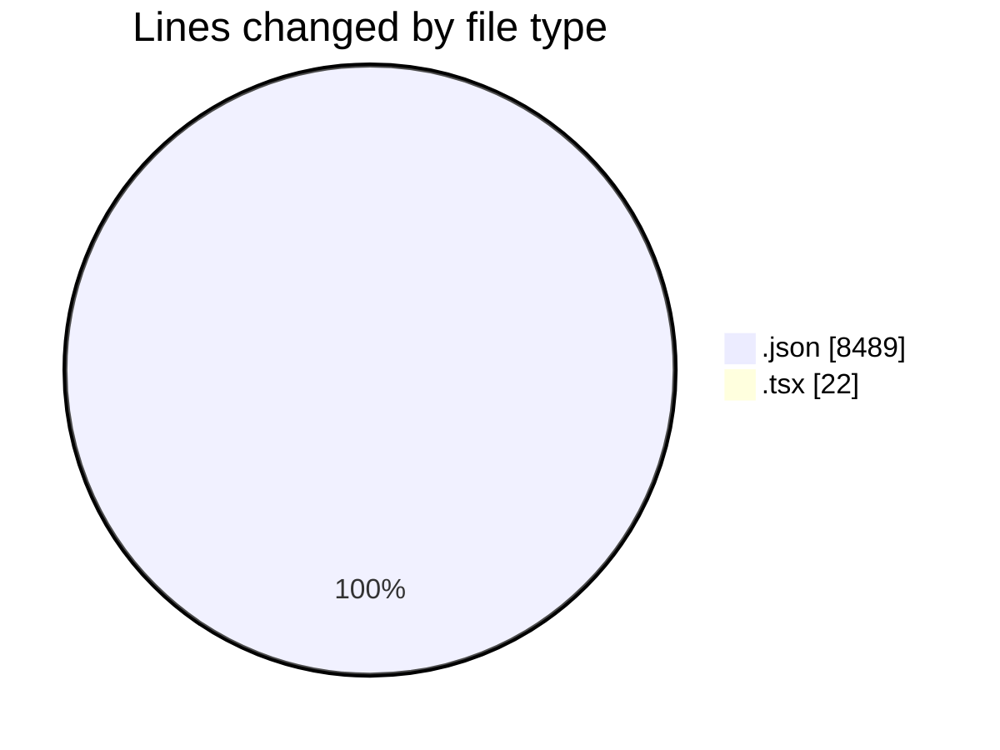
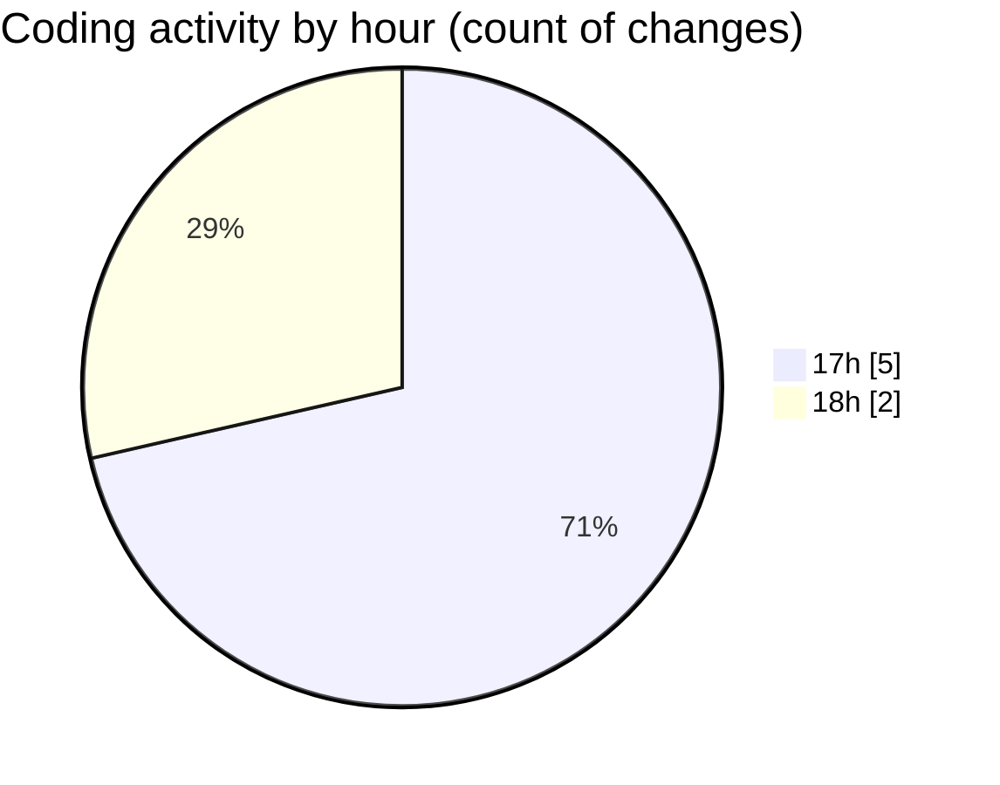

# Untitled (Workspace) - Activity Summary 

## Overall Statistics

| Stat                   | Value                                                             |
| ---------------------- | ----------------------------------------------------------------- |
| **Lines Added** (➕)   | 8509                                          |
| **Lines Removed** (➖) | 2                                        |
| **Net Change** (↕)    | 8507                |
| **Active Time** (⌚)   | 5 minutes |

## Modified Files
- **package.json** (+3, -2)
- **slicemachine.config.json** (+7, -0)
- **package.json** (+43, -0)
- **package-lock.json** (+8434, -0)
- **page.tsx** (+22, -0)

## Visualizations

### By File Type (Lines Changed)

### By Hour (Estimated Activity Count)

> **Last Updated:** 7/4/2025, 6:25:30 PM