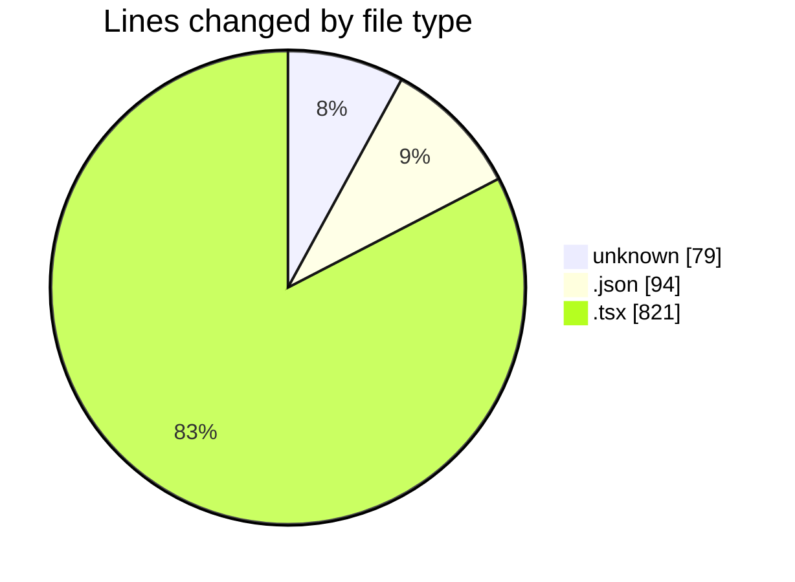
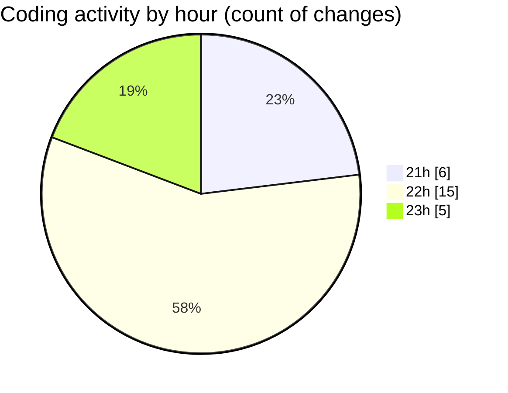

# COHERA - Activity Summary 

## Overall Statistics

| Stat                   | Value                                                             |
| ---------------------- | ----------------------------------------------------------------- |
| **Lines Added** (➕)   | 948                                          |
| **Lines Removed** (➖) | 46                                        |
| **Net Change** (↕)    | 902                |
| **Active Time** (⌚)   | 33 minutes |

## Modified Files
- **.gitignore** (+40, -4)
- **tsconfig.app.json** (+36, -0)
- **COMMIT_EDITMSG** (+17, -1)
- **package.json** (+58, -0)
- **.env** (+17, -0)
- **App.tsx** (+300, -41)
- **SignInForm.tsx** (+92, -0)
- **ProfileSelection.tsx** (+25, -0)
- **ProfileSetup.tsx** (+363, -0)

## Visualizations

### By File Type (Lines Changed)

### By Hour (Estimated Activity Count)

> **Last Updated:** 7/24/2025, 11:24:05 PM