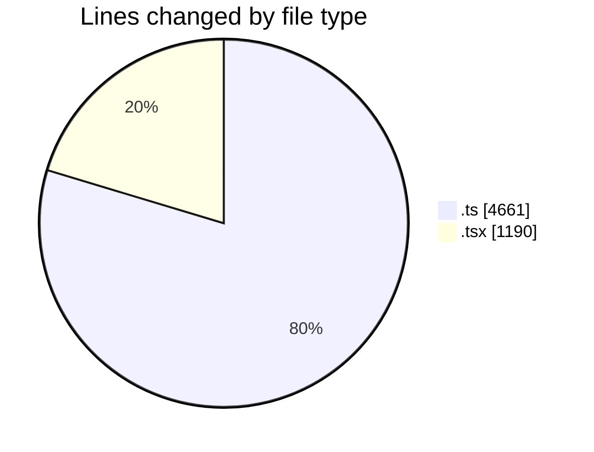
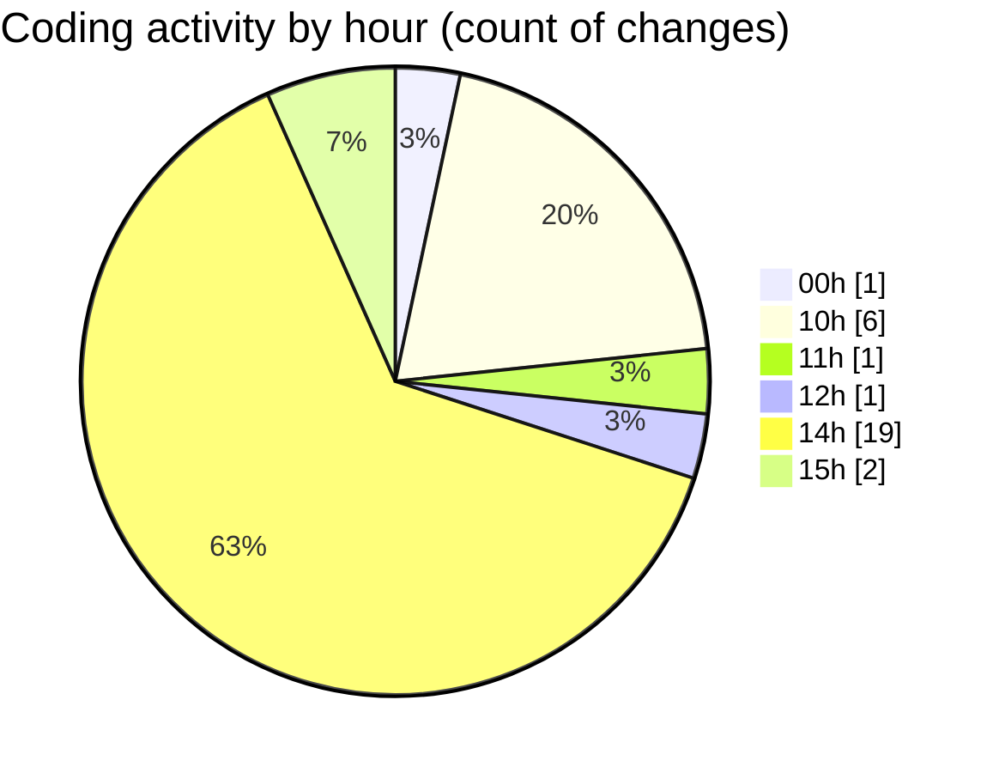

# COHERA - Activity Summary 

## Overall Statistics

| Stat                   | Value                                                             |
| ---------------------- | ----------------------------------------------------------------- |
| **Lines Added** (➕)   | 5807                                          |
| **Lines Removed** (➖) | 44                                        |
| **Net Change** (↕)    | 5763                |
| **Active Time** (⌚)   | 26 minutes |

## Modified Files
- **paymentProcessor.ts** (+538, -0)
- **chatbot.ts** (+840, -1)
- **financial.ts** (+1164, -0)
- **financialAnalytics.ts** (+554, -0)
- **bookings.ts** (+2, -1)
- **chat.ts** (+573, -0)
- **AddProperty.tsx** (+949, -42)
- **schema.ts** (+740, -0)
- **restaurants.ts** (+137, -0)
- **api.d.ts** (+111, -0)
- **AddRestaurantForm.tsx** (+199, -0)

## Visualizations

### By File Type (Lines Changed)

### By Hour (Estimated Activity Count)

> **Last Updated:** 7/25/2025, 3:06:16 PM